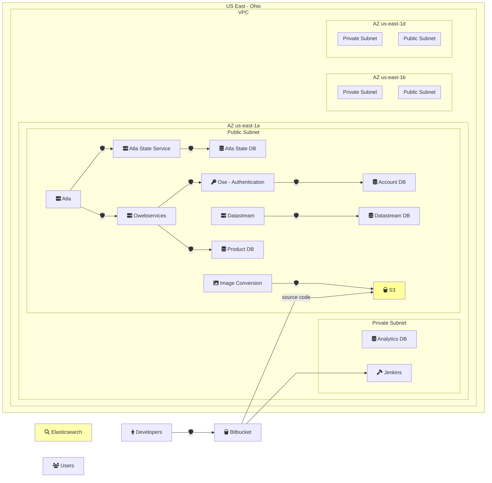

C -->|One| D[]

```mermaid
%%{init: {'flowchart' : {'curve' : 'linear'}}}%%

flowchart LR
  classDef stateful fill:green,fill-opacity:0.3;
  classDef external fill:yellow,fill-opacity:0.3;

  AT[fa:fa-server Atla]
  PR[fa:fa-database Product DB]
  AC[fa:fa-database Account DB]
  AN[fa:fa-database Analytics DB]
  AS[fa:fa-server Atla State Service]
  ASDB[fa:fa-database Atla State DB]
  DS[fa:fa-server Datastream]
  DSDB[fa:fa-database Datastream DB]
  JE[fa:fa-hammer Jenkins]

  EL[fa:fa-search Elasticsearch]:::external
  S3[fa:fa-bucket S3]:::external
  BB[fa:fa-bucket Bitbucket]

  USER[fa:fa-users Users]
  DEV[fa:fa-person Developers]

  AU[fa:fa-key Ose - Authentication]
  OW[fa:fa-server Owebservices]
  IM[fa:fa-image Image Conversion]

  subgraph AZE1A [AZ us-east-1a]
    subgraph Public Subnet
      AT -->|fa:fa-shield| AS & OW
      AS -->|fa:fa-shield| ASDB
      DS -->|fa:fa-shield| DSDB
      OW -->|fa:fa-shield| AU & PR
      IM -->|fa:fa-shield| S3
      AU -->|fa:fa-shield| AC
    end

    subgraph Private Subnet
      AC
      AN
      ASDB
      DSDB
      JE
    end
  end

  subgraph AZE1B [AZ us-east-1b]
    subgraph Public Subnet
    end

    subgraph Private Subnet
      PR
    end
  end

  subgraph AZE1D [AZ us-east-1d]
    subgraph Public Subnet
    end

    subgraph Private Subnet
    end
  end

  subgraph VPC [VPC]
    AZE1A
    AZE1B
    AZE1D
  end

  subgraph REGION [US East - Ohio]
    VPC
  end

  DEV -->|fa:fa-shield| BB -->|fa:fa-webhook| JE

  click BB "https://bitbucket.org"

  BB -->|source code| S3
```
